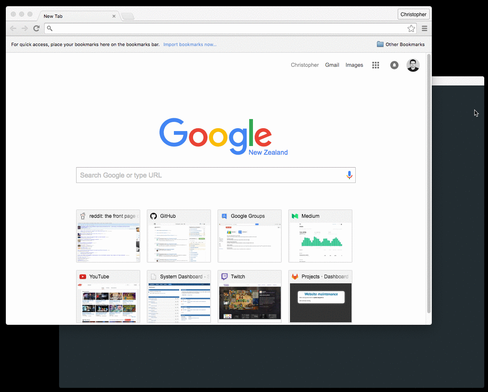

# SilverStripe Serve

A simple dev task, to start a development server for your SilverStripe app.

## Getting started

```sh
$ composer require silverstripe/serve
$ framework/sake dev/build flush=1
$ framework/sake dev/tasks/SilverStripe-Serve-Task
```

This will start the server at `http://localhost:8080`.

You can override the host/port:

```sh
$ framework/sake dev/tasks/SilverStripe-Serve-Task host=127.0.0.1 port=8000
```


